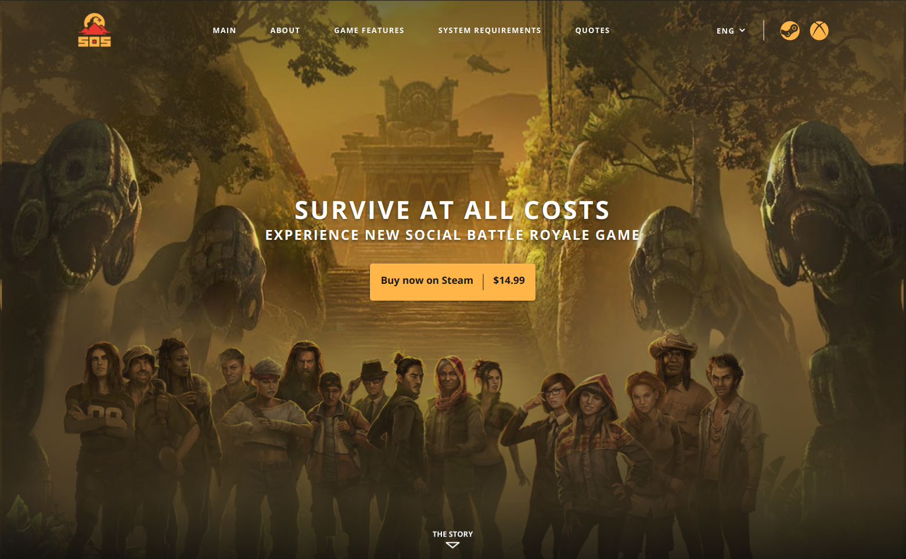

<h1 align="center">SOS Landing Page</h1>

---

## 📝 Tabela de conteúdo
-   [Sobre](#about)
-   [Preview](#demo)
-   [Construído usando](#built_using)
-   [Deploy](#deployment)
-   [Rodando o projeto](#getting_started)
-   [Autor](#authors)

## 🧐 Sobre <a name = "about"></a>

Uma landing page feita para aprender e treinar o React junto com o css modules.

## 🎥 Preview <a name = "demo"></a>



## ⛏️ Consturído usando <a name = "built_using"></a>

-   [React](https://pt-br.reactjs.org/) - Framework Javascript para desenvolvimento WEB
-   [SCSS](https://sass-lang.com/) - Pré-processador de CSS
-   [Vite](https://vitejs.dev/) - Ferramenta de build

## 🚀 Deploy <a name = "deployment"></a>

Para visualizar a aplicação, acesse:

-   **Netlify**: https://wondrous-lebkuchen-81b93f.netlify.app/

---

## 🏁 Rodando o projeto <a name = "getting_started"></a>

Siga as seguintes instruções para rodar a aplicação em sua máquina.

### Pré-requisito

Para executar esse projeto, você vai precisar do [Node](https://nodejs.org/pt-br/) e seu gerenciador de pacotes(npm) instalado em sua máquina.

Faça o clone do projeto e siga para seção de instalação

```
gh repo clone Vsspaulasouza/soslandingpage
```

### Instalação

Instale todas as dependências do projeto

```
npm i
```

Após instalar as dependências, basta executar o projeto

```
npm run dev
```

Após isso será gerado um link para acesso à aplicação rodando em seu ambiente local.

---

## ✍️ Autor <a name = "authors"></a>

| [](https://github.com/Vsspaulasouza) |
| -------------------------------------------------------------------------------------------------------------- |
| [Vinícius Soares](https://github.com/Vsspaulasouza)
